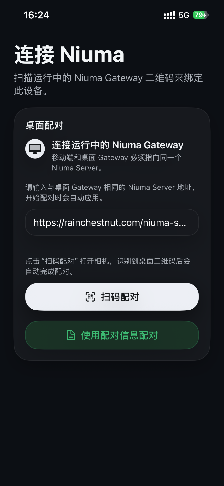
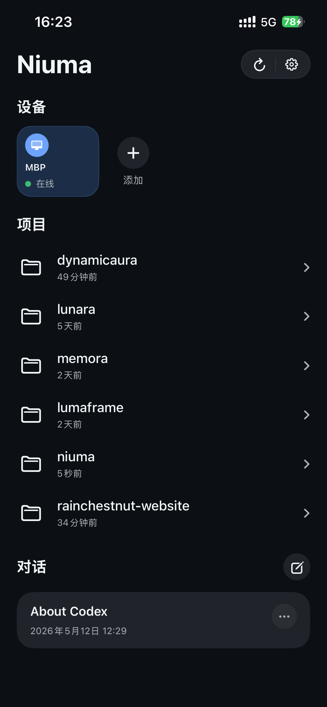
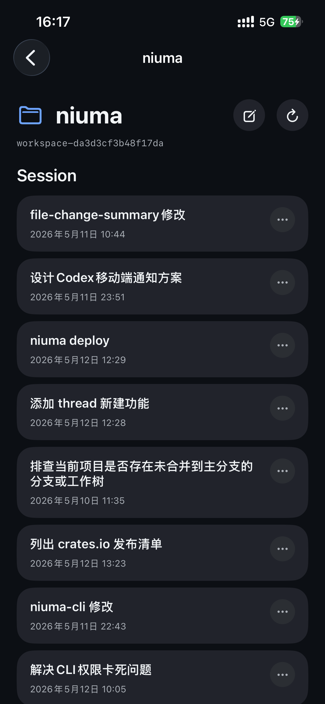
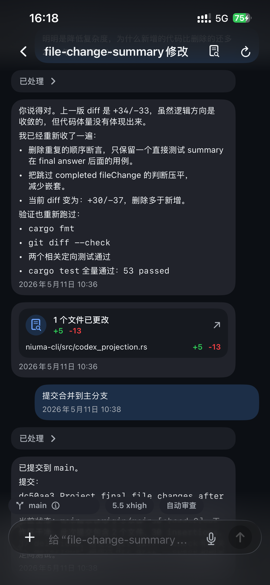
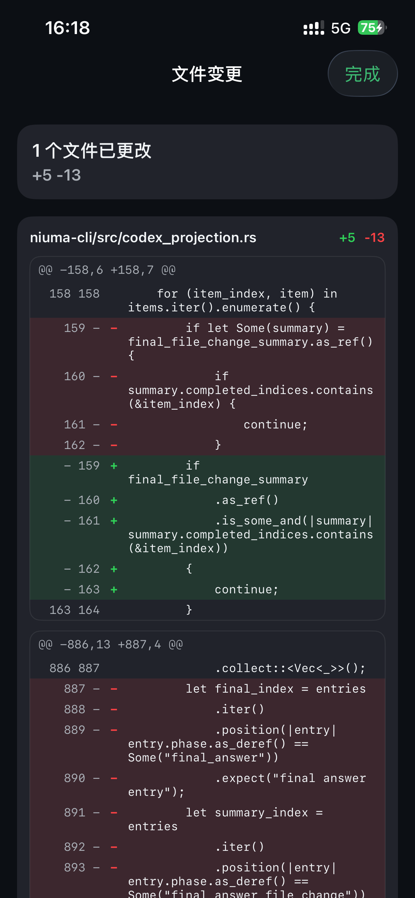

# Niuma

[中文说明](README.zh-CN.md)

Niuma is an experimental mobile-to-Codex control plane. The repository contains
the iOS client, the Rust desktop gateway, the Rust routing server, and the
design documents that define their boundaries.

## Direct Use

Use the released channels when you only want to run Niuma:

The `niuma` CLI is not an AI agent. It is a desktop connector that lets the
Niuma iOS app talk to Codex by starting or connecting to `codex app-server`.
Install Codex before starting the Niuma gateway.

1. Install Codex.app or the Codex CLI.
2. Install the iOS app from the App Store.
3. Install the desktop gateway:

```bash
cargo install niuma
```

4. Use the hosted Niuma Server URL in the iOS app and desktop gateway settings:

```text
https://rainchestnut.com/niuma-server
```

5. Start the desktop gateway and pair the iOS app with the QR code shown by the
   local dashboard:

```bash
niuma gateway
```

For background use on macOS:

```bash
niuma service install --start
niuma service status
```

The desktop gateway expects Codex.app or a `codex` executable on `PATH` so it
can start `codex app-server`.

## App Preview

The screenshots below follow the normal mobile flow: pair with the desktop
gateway, review connected devices and workspaces, open a project session list,
continue a Codex thread, and inspect file-change details. The current preview
uses the app's Chinese localization.

| Pair with the desktop gateway | Review devices and projects | Open workspace sessions |
| --- | --- | --- |
|  |  |  |
| Continue a Codex thread | Inspect file-change details | |
|  |  | |

## Architecture


The pairing and message path uses end-to-end encryption. The server relays and
stores encrypted data and metadata, but never plaintext message content.


## Repository Shape

This root is the public source boundary. It is not a single buildable monorepo;
each runtime has its own project files and dependency setup.

```text
design/         Architecture and product design notes.
docs/           Planning notes kept with the source snapshot.
niuma-ios/      Native SwiftUI iOS app and Xcode project.
niuma-cli/      Rust desktop gateway installed as the `niuma` command.
niuma-server/   Rust control-plane server.
```

The server stays payload-blind. Message bodies are routed through the
mobile/gateway channel, and file transfer payloads are stored only as temporary
content-addressed relay bytes. Server-side code must not persist cleartext
conversation content or interpret filename, MIME, preview, or attachment display
metadata.

## File Transfer Boundary

Niuma uses one content-part shape for every attachment type:

- `file_ref` is the only attachment reference used between iOS and the desktop gateway.
- `file_type` describes the broad rendering class: `image`, `video`, or `file`.
- `transfer_id` is the SHA-256 of the complete transfer payload and is stable across iOS, server, gateway, and Codex replay projection.

Transfers use single-payload upload. A sender first ensures
`POST /transfers/{transfer_id}/ensure`, uploads the complete payload with
`PUT /transfers/{transfer_id}` only when `needs_upload` is true, then the
receiver downloads with `GET /transfers/{transfer_id}` and acknowledges local
availability with `POST /transfers/{transfer_id}/ack`.

iOS stores a SwiftData mapping from `transfer_id` to the local attachment file.
The desktop gateway stores transfer payloads under `~/.niuma/transfers` and
materializes mobile files into real Codex-readable file inputs.

## Public Commit Boundary

The public repository includes source code, design docs, static app assets, and
example configuration files.

The public repository excludes:

- local secrets such as `niuma-server/.env`;
- legacy Python virtual environments, package caches, and `__pycache__`;
- Swift/Xcode derived data, user state, and local scheme metadata;
- runtime state such as `~/.niuma` or legacy `.niuma-state`;
- local logs, temporary databases, and generated archives.

Do not commit pairing tokens, session tokens, device identities, private keys,
or local transfer payloads. Keep real deployment values in local environment
files or a secret manager.

## iOS App

The iOS app is a native SwiftUI project. For normal use, install the published
app from the App Store. For source development:

```bash
cd niuma-ios
xcodebuild -list -project "niuma.xcodeproj"
xcodebuild -scheme "niuma" -project "niuma.xcodeproj" -destination "platform=iOS Simulator,name=iPhone 17" build
```

Runtime wiring starts in `niuma/App/NiumaApp.swift`, with dependencies assembled
in `niuma/App/AppContainer.swift` inside `niuma-ios/`. The app uses SwiftData for local mobile state
and talks to the server through `LiveNiumaController`.

## Desktop Gateway

The desktop bridge is the Rust `niuma` binary. It is installed through Cargo and
can run in the foreground or as a macOS LaunchAgent service.

Package documentation lives with the crate: [English](niuma-cli/README.md),
[中文](niuma-cli/README.zh-CN.md).

```bash
cargo install niuma
niuma gateway
niuma service install --start
niuma service restart
niuma status
```

For local source builds, use `cargo install --path niuma-cli` from the repository
root.

The gateway prefers the Codex.app bundled `codex app-server` binary and falls
back to the `codex` executable on `PATH` when Codex.app is unavailable. It owns
desktop identity, server registration/authentication, the local pairing page,
Codex app-server initialization, metadata refresh projection, `task_start`,
`resume_thread`, app-server notification replay for active threads, approval
callbacks, request-user-input callbacks, and server-backed file transfer
materialization.

## Server

The hosted Server URL for normal use is:

```text
https://rainchestnut.com/niuma-server
```

For source development, the server is a Rust control-plane process built with
axum, tokio, and sqlx.

```bash
cd niuma-server
cargo run
```

Configuration comes from built-in defaults plus `NIUMA_*` environment variables
and optional local `.env` files. `NIUMA_DATABASE_URL` must use standard
`postgresql://` or `postgres://` syntax.

## Verification

There is no root task runner. Use the project-local build and test commands:

```bash
cd niuma-cli && cargo fmt --check && cargo check && cargo test
cd niuma-server && cargo fmt --check && cargo check && cargo test
cd niuma-ios && xcodebuild -scheme "niuma" -project "niuma.xcodeproj" -destination "platform=iOS Simulator,name=iPhone 17" build
```

Keep future tests focused on protocol boundaries: transfer projection, SwiftData
timeline merge, and one installed-gateway visible E2E path.
