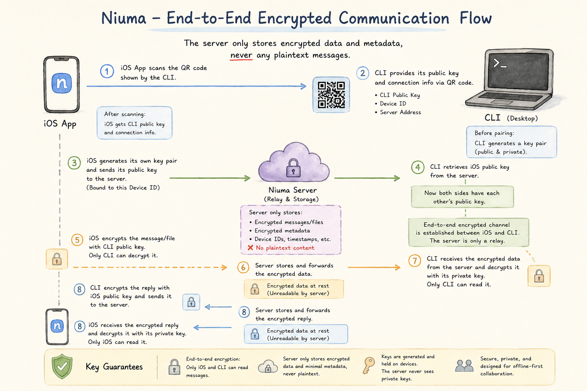

# Niuma

[English](README.md)

Niuma 是一个实验性的移动端到 Codex 控制面项目。这个仓库包含 iOS 客户端、
Rust 桌面 Gateway、Rust 路由 Server，以及定义它们边界的设计文档。

## 直接使用

如果只是运行 Niuma，请使用发布渠道：

`niuma` CLI 不是 AI agent。它是一个桌面连接器，让 Niuma iOS app 可以通过
启动或连接 `codex app-server` 来使用 Codex。因此启动 Niuma Gateway 前，
需要先安装 Codex。

1. 安装 Codex.app 或 Codex CLI。
2. 从 App Store 安装 iOS app。
3. 安装桌面 Gateway：

```bash
cargo install niuma
```

4. 在 iOS app 和桌面 Gateway 设置中使用托管的 Niuma Server 地址：

```text
https://rainchestnut.com/niuma-server
```

5. 启动桌面 Gateway，并用本地 dashboard 显示的二维码配对 iOS app：

```bash
niuma gateway
```

macOS 后台运行：

```bash
niuma service install --start
niuma service status
```

桌面 Gateway 需要 Codex.app，或者需要 `PATH` 上有可用的 `codex` 可执行文件，
以便启动 `codex app-server`。

## 架构概览


配对和消息链路使用端到端加密。Server 只中继和保存加密数据及 metadata，
不保存明文消息内容。



## 仓库结构

仓库根目录是公开源码边界。它不是一个可以整体构建的 monorepo；每个 runtime
都有自己的项目文件和依赖配置。

```text
design/         架构和产品设计说明。
docs/           随源码快照保留的规划说明。
niuma-ios/      原生 SwiftUI iOS app 和 Xcode 项目。
niuma-cli/      Rust 桌面 Gateway，安装后提供 `niuma` 命令。
niuma-server/   Rust 控制面 Server。
```

Server 保持 payload-blind。消息正文通过移动端和 Gateway 通道转发，文件
transfer payload 只作为临时的 content-addressed relay bytes 保存。Server
端代码不能持久化明文会话内容，也不能解释文件名、MIME、preview 或附件展示
metadata。

## 文件传输边界

Niuma 对所有附件类型使用统一的 content-part 结构：

- `file_ref` 是 iOS 和桌面 Gateway 之间唯一使用的附件引用。
- `file_type` 描述粗粒度渲染类型：`image`、`video` 或 `file`。
- `transfer_id` 是完整 transfer payload 的 SHA-256，在 iOS、Server、
  Gateway 和 Codex replay projection 中保持稳定。

Transfer 使用单 payload 上传。发送端先通过
`POST /transfers/{transfer_id}/ensure` 确认是否需要上传，只有当
`needs_upload` 为 true 时才用 `PUT /transfers/{transfer_id}` 上传完整
payload。接收端通过 `GET /transfers/{transfer_id}` 下载，并通过
`POST /transfers/{transfer_id}/ack` 确认本地可用。

iOS 使用 SwiftData 保存 `transfer_id` 到本地附件文件的映射。桌面 Gateway
把 transfer payload 存在 `~/.niuma/transfers`，并把移动端文件物化成 Codex
可以读取的真实文件输入。

## 公开提交边界

公开仓库包含源码、设计文档、静态 app 资源和示例配置文件。

公开仓库不包含：

- 本地密钥，例如 `niuma-server/.env`；
- 旧 Python 虚拟环境、包缓存和 `__pycache__`；
- Swift/Xcode derived data、用户状态和本地 scheme metadata；
- runtime 状态，例如 `~/.niuma` 或旧 `.niuma-state`；
- 本地日志、临时数据库和生成的归档文件。

不要提交 pairing token、session token、device identity、private key 或本地
transfer payload。真实部署值应保存在本地环境文件或 secret manager 中。

## iOS App

iOS app 是原生 SwiftUI 项目。普通使用请从 App Store 安装发布版。源码开发
时使用：

```bash
cd niuma-ios
xcodebuild -list -project "niuma.xcodeproj"
xcodebuild -scheme "niuma" -project "niuma.xcodeproj" -destination "platform=iOS Simulator,name=iPhone 17" build
```

Runtime 入口在 `niuma-ios/niuma/App/NiumaApp.swift`，依赖组装在
`niuma-ios/niuma/App/AppContainer.swift`。App 使用 SwiftData 保存移动端本地
状态，并通过 `LiveNiumaController` 和 Server 通信。

## Desktop Gateway

桌面桥接是 Rust `niuma` 二进制。它通过 Cargo 安装，可以以前台方式运行，也
可以作为 macOS LaunchAgent 后台服务运行。

CLI 包文档位于 crate 目录：[English](niuma-cli/README.md)，
[中文](niuma-cli/README.zh-CN.md)。

```bash
cargo install niuma
niuma gateway
niuma service install --start
niuma service restart
niuma status
```

如果从本仓库源码构建，请在仓库根目录使用 `cargo install --path niuma-cli`。

Gateway 优先使用 Codex.app 内置的 `codex app-server` 二进制；当 Codex.app
不可用时，回退到 `PATH` 上的 `codex` 可执行文件。它负责桌面身份、
Server 注册和认证、本地配对页面、Codex app-server 初始化、metadata refresh
projection、`task_start`、`resume_thread`、活跃 thread 的 app-server
notification replay、approval callback、request-user-input callback，以及基于
Server 的文件 transfer 物化。

## Server

普通使用时，托管 Server 地址是：

```text
https://rainchestnut.com/niuma-server
```

源码开发时，Server 是基于 axum、tokio 和 sqlx 构建的 Rust 控制面进程。

```bash
cd niuma-server
cargo run
```

配置来自内置默认值、`NIUMA_*` 环境变量，以及可选的本地 `.env` 文件。
`NIUMA_DATABASE_URL` 必须使用标准 `postgresql://` 或 `postgres://` 语法。

## 验证

仓库根目录没有统一 task runner。请使用各项目自己的构建和测试命令：

```bash
cd niuma-cli && cargo fmt --check && cargo check && cargo test
cd niuma-server && cargo fmt --check && cargo check && cargo test
cd niuma-ios && xcodebuild -scheme "niuma" -project "niuma.xcodeproj" -destination "platform=iOS Simulator,name=iPhone 17" build
```

后续测试应聚焦协议边界：transfer projection、SwiftData timeline merge，以及
一个安装后 Gateway 的可见 E2E 路径。
