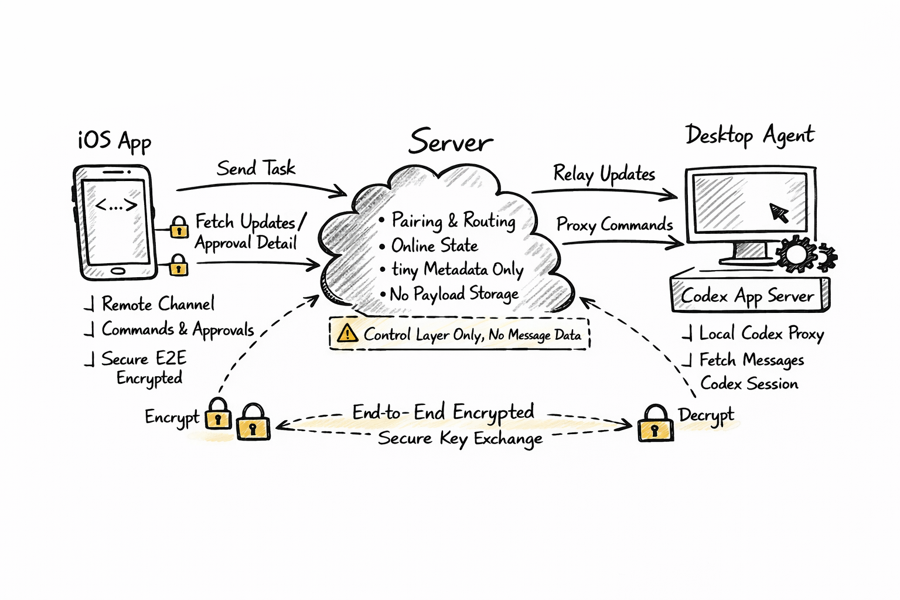

# Niuma 系统概要设计

## 1. 文档定位

本文档作为 **Niuma 项目概要设计**，用于统一系统边界、架构原则、模块拆分、关键流程和实施范围。

本文档不展开实现细节。详细实现方案拆分到以下文档：

- [iOS 端详细设计](./niuma_ios_detailed_design.md)
- [Server 端详细设计](./niuma_server_detailed_design.md)
- [Desktop Agent 详细设计](./niuma_desktop_agent_detailed_design.md)

---

## 2. 系统目标

Niuma 不是独立的 Codex 客户端，而是：

> **Codex 桌面实例的移动端远程 channel。**

系统目标：

- 让用户在 iPhone 上以精简版 Codex 的方式查看项目与 session
- 让用户在移动端继续已有 session 或发起新任务
- 在不保存业务数据到服务端的前提下，实现安全的远程控制、审批处理和断线恢复
- 建立“少索取、少保存、强设备信任”的产品心智

---

## 3. 技术选型

### 3.1 技术栈

- iOS 端：`Swift`
- Server 端：`Rust`
- Desktop Agent：`Rust`

### 3.2 桌面 Agent 形态

Desktop Agent 不单独做成一套孤立桌面应用，而是：

- 以 `niuma-cli` Rust 工程提供，安装后暴露 `niuma` 命令
- 通过 **`Codex App Server` 模式**接入 Codex，优先使用 Codex.app 自带 app-server，缺失时回退到 PATH 中的 `codex`
- 通过 `niuma gateway` 提供移动端桥接、协议转换、设备鉴权、恢复和审批代理能力
- 通过 `niuma service` 注册 macOS LaunchAgent 后台进程
- 旧 Python 插件实现已删除；Rust Gateway 是唯一桌面运行时

---

## 4. 核心设计原则

### 4.1 Server 只做控制面

Server 负责：

- 设备注册与设备鉴权
- 配对关系维护
- 在线状态维护
- 消息路由与实时转发
- 推送唤醒
- 最小控制面状态

Server 不负责：

- 保存 prompt
- 保存输出结果
- 保存审批正文
- 保存 diff
- 保存任何业务明文或密文 payload

### 4.2 Codex 是业务真相源

- 项目、session、thread 与会话内容由 Codex 保存
- 恢复、审批详情和线程续接都回源到桌面侧 Codex
- Agent 不另建业务消息数据库

### 4.3 明文仅存在于端侧

业务明文只存在于：

- iOS 本地
- 桌面本地的 Agent / Codex 环境

### 4.4 无账号，强设备信任

- 系统不要求用户账号登录
- iOS 与 Desktop Agent 都持有长期设备密钥
- 控制面访问基于设备 challenge / response 鉴权
- 配对用于建立“哪台手机可以控制哪台桌面”的关系

### 4.5 Push 只做唤醒

APNs 只承载提醒与唤醒，不承载明文业务内容。通知 payload 可以携带 Gateway 生成的
端到端加密密文；移动端点击通知后解密出 `thread_id`，再通过
`resume_thread` 刷新详情。

---

## 5. 总体架构

### 5.1 架构图

### 5.2 模块划分

系统由五个核心部分组成：

#### 1）Niuma iOS App

负责：

- 初始化匿名设备身份
- 设备配对
- 项目与 session 浏览
- 新任务与已有 session 继续发送
- 审批查看与审批决策
- 本地缓存、加密和恢复

#### 2）Server Control Plane

负责：

- 设备注册
- 设备签名鉴权
- 配对 token 管理
- WebSocket 路由
- 元数据实时转发
- 临时 transfer relay

#### 3）Desktop Agent Gateway

负责：

- 作为 `Codex App Server` 客户端接入 Codex
- 读取 Codex 桌面的 workspace / projectless conversation 本地状态
- 维护与 Server 的长连接
- 将移动端协议映射为 Codex 可理解调用
- 将 Codex 状态映射为移动端可消费模型
- 处理恢复、审批详情读取、协议去重和顺序控制

#### 4）Codex App Server

负责：

- 作为官方 rich client 集成入口
- 对外暴露 thread / turn / item / approval 能力
- 通过 `stdio` 或 `websocket` 提供双向 JSON-RPC

#### 5）Local Codex

负责：

- 保存项目、session、thread 和会话内容
- 执行任务
- 产生增量输出
- 触发审批
- 提供恢复所需数据

---

## 6. 信息架构

### 6.1 移动端信息结构

Niuma 对齐 Codex 的核心结构，采用两个主要维度：

- workspace 项目
- 无项目对话 / session

约束如下：

- 一个桌面设备下可以有多个项目
- 一个项目下可以有多个 session
- Codex 桌面的无项目对话不归入任意 workspace 项目，使用 `__conversation__` 会话桶单独展示
- session 是移动端聊天列表维度
- thread 是执行与增量同步维度

### 6.2 页面层级

- 首页：设备状态 + 项目列表 + 最近 session
- 配对页：扫码 / 配对码输入
- 新任务页：选择项目、选择或新建 session、输入任务
- 线程页：查看输出、继续对话、恢复线程
- 审批页：查看详情并决策

---

## 7. 关键流程概要

### 7.1 首次配对

- Gateway 向 Server 注册并申请一次性配对 token
- Gateway 生成长期 Ed25519 签名密钥、长期 X25519 加密密钥和本次配对的一次性 X25519 密钥
- 桌面展示包含 `agent_id`、`pair_token`、`agent_signing_public_key`、`agent_encryption_public_key`、`agent_pairing_public_key` 和签名的二维码
- iOS 扫码后用本次配对公钥加密自己的长期加密公钥，并调用 `/pair/confirm`
- Server 校验 token、签名和在线状态，但不解密握手内容
- Server 将 `encrypted_handshake` relay 给在线 Gateway
- Gateway 解密、保存移动端长期加密公钥，并返回 signed ack
- Server 只在收到 Gateway signed ack 后建立 `ios_device_id <-> agent_id` 绑定

### 7.2 发起任务

- iOS 选择设备和项目；已有 thread 继续带 `thread_id`，新任务不带 `thread_id`
- iOS 加密业务 payload，并附带 `project_id`、可选 `thread_id`、可选 `model`
- iOS 不生成 canonical message id；消息编号由桌面侧 Codex 入库后产生
- Server 转发到 Agent
- Agent 解密后通过 `Codex App Server` 调用 Codex thread / turn 能力
- Codex 执行并产生输出
- Agent 通过 `thread/read(includeTurns=true)` 按 Codex turn/item 顺序投影 `seq` 并回传更新

### 7.3 审批处理

- Codex 触发审批事件
- Agent 将审批元数据和审批详情能力暴露给 iOS
- iOS 做允许 / 拒绝
- 可选支持“当前 thread、指定审批类型、限时 TTL”的 scoped grant

### 7.4 断线恢复

- iOS 记录 `checkpoint / cursor`
- 重连时发起 `resume_thread`
- Agent 通过 `Codex App Server` 读取或恢复 thread
- Agent 只按消息单位回放缺失的 `task_update`，并用 `thread_sync_completed` 标记完成
- `seq` 由 Agent 按 Codex `thread/read` 的 turn 顺序和 turn 内 item 顺序薄投影，是移动端排序的唯一依据；移动端不得用时间窗口或本地临时 ID 修正顺序。
- 实时通知不再自增 `seq`，只触发同一条 `thread/read` 投影路径。历史回放和实时更新必须投影出同一组稳定 `entry_id`；Gateway 只透传 Codex item 原生 `type` 和 `phase`，过程项由移动端按这两个原生字段在 UI 层聚合展示。
- 后台 APNs 进度提醒不改变详情同步协议。它只能在 Gateway 确认 Codex turn 终态后发送，
  且点击后仍回到 `resume_thread -> task_update* -> thread_sync_completed`。

---

## 8. 安全概要

### 8.1 设备鉴权

- 无账号体系
- 设备级长期密钥
- challenge / response 验签
- nonce 去重
- 时间窗口校验

### 8.2 端到端加密

- iOS 与 Agent 之间进行应用层加密
- Server 只转发不可解密
- 配对阶段交换双方长期加密公钥，业务消息使用双方长期 X25519 公钥与 `binding_id` 派生 pair-scoped 对称密钥；Server 仍按 payload-blind 控制面处理。

### 8.3 暴露面控制

- Server 公开入口仅保留设备注册、challenge、配对相关能力
- 其余 REST / WebSocket 默认需要设备签名鉴权
- 公开入口需具备限流、短时 token、失败次数限制

---

## 9. 数据边界

### 9.1 Server 保存

- 设备身份
- 配对关系
- 连接状态
- push token
- 审计元数据

### 9.2 Server 不保存

- 业务会话正文
- prompt
- 审批正文
- diff
- 执行结果
- 业务密文历史

### 9.3 多媒体与文件传输边界

图片、视频和文件属于业务数据，不能改变“Server 只做控制面”的原则。Niuma 只把 Server 作为短时中转通道，不把媒体内容或文件内容写入 PostgreSQL，也不把它们作为服务端可长期查询的数据。

系统采用统一的 `content_parts` 抽象描述移动端与桌面端之间的消息内容：

- `text`：普通文本。
- `file_ref`：统一文件引用，图片、视频和普通文件都使用这一种协议形态。
- `file_type`：`file_ref` 的宽类型，当前使用 `image`、`video`、`file` 描述移动端渲染入口和安全探测方向。

传输边界：

- iOS 发送图片、视频或文件时统一在 `content_parts` 中携带 `file_ref`，用 `file_type` 区分渲染类型，不再产生图片、视频或 Base64 专用协议字段。
- `transfer_id` 由完整 transfer payload 的 SHA-256 生成，整条链路都使用该值作为内容地址；Server 根据 `transfer_id` 是否已有完整 payload 决定是否需要重新上传。
- iOS 本地用 SwiftData 表保存 `transfer_id -> 本地附件相对路径` 的映射；已发送和已接收附件都先命中本地缓存，命中失败才从 Server 临时缓存下载。
- iOS 发送附件时先通过 Server 临时中转到 Desktop Agent；Gateway 默认保存到 `~/.niuma/transfers/inbound/<transfer_id>/`，图片会转换为 Codex 可读的真实本地图片输入，普通文件按 Codex 当前支持的本地路径输入形态传入。
- Gateway 启动 Codex turn 后，需要把移动端原始 `content_parts` envelope 绑定到 Codex `turn_id`。之后 live echo 和 `thread/read` replay 都用这份原始 envelope 投影用户消息，避免附件消息退化为纯文本文件路径。
- Desktop Agent 从 Codex 读取输出时，只在 `item/completed` 或 `turn/completed` 后识别 `input_image`、可通过 MIME 和文件签名校验的 raster data URL、Markdown 图片语法、Markdown 文件链接和本地绝对路径，再转换成 `file_ref`。大图片、文件和视频不能塞进 `task_update` WebSocket 帧，必须转换为 transfer 引用；`agentMessage/delta` 只用于过程状态，不能触发媒体上传。
- Transfer 不分片。上传端先 `ensure` 一个 content-addressed transfer，再用 `PUT /transfers/:transfer_id` 上传完整 payload；Server 校验 `sha256(body) == transfer_id`、大小限制和参与设备绑定关系。
- Server 的临时中转文件必须有 TTL、大小限制和 ACK。ACK 只表示目标端已具备本地可用副本，Server 可以刷新临时缓存有效期；真正删除由 TTL 清理或服务启动清理负责。
- 不引入“同机模拟器直连 Gateway 下载端点”等临时旁路方案。即使本地联调，也走与真实业务一致的 Server 中转链路。

---

## 10. 状态模型概要

### 10.1 配对与连接状态

- `unpaired`
- `paired_offline`
- `paired_online`

### 10.2 Session / Thread 状态

- `created`
- `running`
- `waiting_approval`
- `completed`
- `failed`
- `cancelled`

### 10.3 审批状态

- `none`
- `pending`
- `resolved`

---

## 11. API 与协议概要

### 11.1 控制面 API

- `POST /devices/register`（桌面 Gateway 注册自身；iOS 注册随 `/pair/confirm` 完成）
- `POST /auth/challenge`
- `POST /auth/verify`
- `POST /pair/request`
- `POST /pair/confirm`
- `POST /pair/revoke`
- `GET /devices`
- `POST /transfers/:transfer_id/ensure`
- `PUT /transfers/:transfer_id`
- `GET /transfers/:transfer_id`
- `POST /transfers/:transfer_id/ack`

Project、session、thread、approval metadata 不再通过 server HTTP 全量读取；桌面 Gateway 通过实时通道逐条推送，移动端保存到 SwiftData。Gateway 侧项目来源唯一收敛为 Codex 桌面的 `~/.codex/.codex-global-state.json`：

- workspace 项目来自 `project-order`、`electron-saved-workspace-roots`、`active-workspace-roots`。
- 无项目对话来自 `projectless-thread-ids`，移动端以 `__conversation__` 作为会话桶展示，不生成对应 `project_sync`。
- session/thread 来自对每个 workspace root 执行 scoped `thread/list(cwd=<workspace_root>, archived=...)`；不得恢复 `cwd=null` 的全局 thread 扫描。
- thread 标题修改走实时控制链路：移动端发送 `thread_rename_request`，Server 只认证和路由，
  Gateway 调 Codex app-server `thread/name/set` 修改 Codex 原 thread title，随后用
  `thread_sync` 把权威标题投影回移动端。移动端不得只写本地标题别名。

### 11.2 实时通道

- `/ws/mobile`
- `/ws/agent`

### 11.3 关键协议字段

- `entry_id`
- `project_id`
- `thread_id`
- `seq`
- `cursor`
- `checkpoint`
- `device_id`
- `nonce`
- `signature`
- `ciphertext`
- `content_parts`
- `transfer_id`
- `file_type`
- `mime_type`
- `size_bytes`
- `encrypted_size_bytes`

---

## 12. 工程拆分

### 12.1 iOS 端

- 使用 `Swift` 开发
- 子项目目录：`/niuma`
- 负责 UI、状态管理、本地安全、APNs、恢复逻辑与加解密

### 12.2 Server 端

- 使用 `Rust` 开发
- 子项目目录：`/niuma-server`
- 负责设备鉴权、WebSocket 路由、元数据转发、临时 transfer relay 与暴露面控制

### 12.3 Desktop Agent 端

- 使用 `Rust` 开发
- 子项目目录：`/niuma-cli`
- 安装命令：`cargo install --path niuma-cli`
- 前台运行命令：`niuma gateway [OPTIONS]`
- 后台服务命令：`niuma service install/start/stop/restart/uninstall/status`
- 诊断命令：`niuma status [OPTIONS]`
- 重置命令：`niuma reset --yes`
- 帮助命令使用 ASCII 短横线：`niuma --help`、`niuma gateway --help`；不支持长破折号混用写法
- 负责本地 Codex 接入、协议转换、metadata refresh、`task_start`、`resume_thread` 和活跃 thread replay
- 负责审批代理、request-user-input 回调、iOS 入站 `transfer_id` 文件 materialization、Codex 出站 inline 图片转 `agent_to_ios` transfer

---

## 13. MVP 范围

### 13.1 必做

- iOS 匿名设备初始化
- 设备配对
- 项目与 session 浏览
- 新任务与已有 session 继续发送
- 流式线程展示
- 审批请求与审批响应
- `seq / ack` 恢复机制
- Server 无业务数据持久化
- 图片、视频、文件的基础收发与临时中转

### 13.2 暂缓

- 多手机共享同一桌面
- Web 管理后台
- 多桌面任务编排
- 服务端会话搜索
- 桌面离线业务兜底

---

## 14. 风险与约束

- 桌面必须在线
- Agent 必须能稳定接入本地 Codex
- Codex 桌面本地状态必须能提供 workspace roots 与 projectless thread ids；session/thread 由 app-server scoped `thread/list` 和 `thread/read` 读取
- iOS 后台恢复与推送唤醒效果受系统限制影响
- 若 Codex 无法读取 thread 历史，移动端只能提示恢复失败，不能自行构造完成态

---

## 15. 结论

Niuma 的系统设计应坚持以下主线：

- 产品上：精简版 Codex 移动 channel
- 架构上：Server 仅控制面，Codex 为真相源
- 安全上：无账号、强设备认证、端到端加密
- 工程上：iOS 用 Swift，Server 用 Rust，Desktop Agent 用 Rust `niuma-cli` 实现
